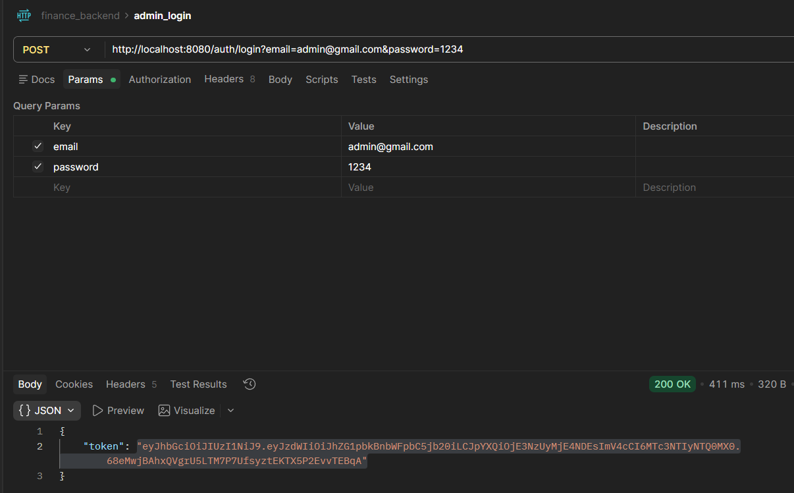
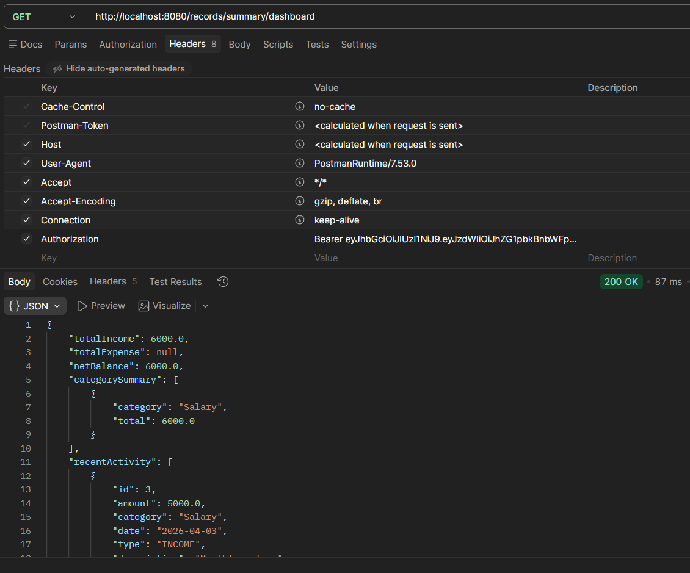
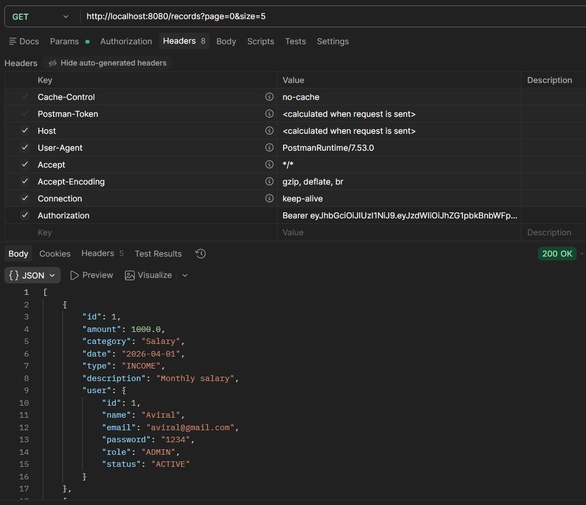
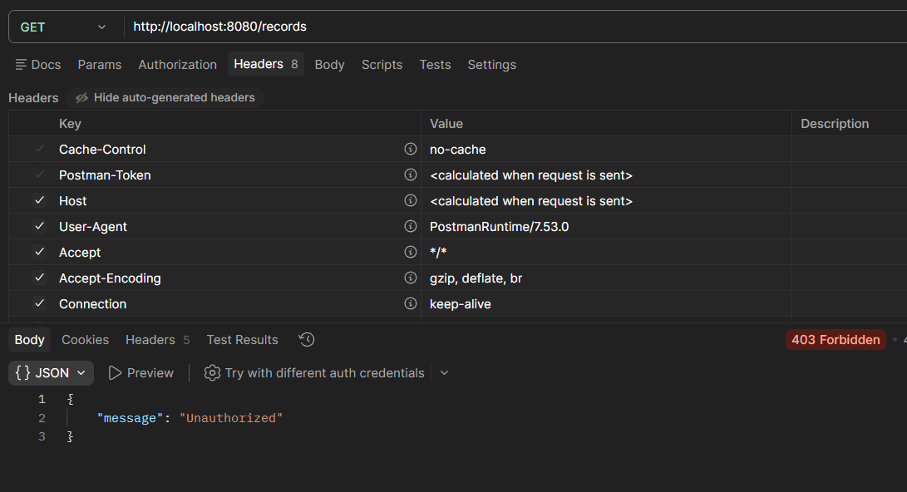
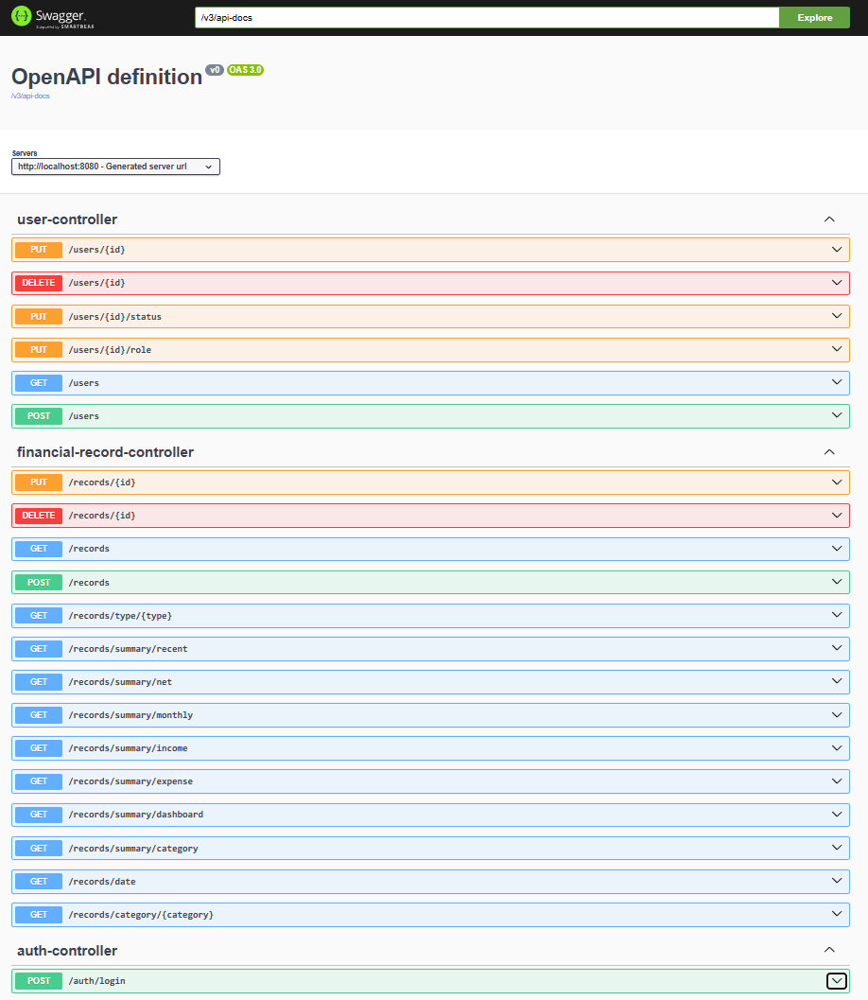

# 💰 Finance Dashboard Backend

## 📌 About the Project

I built this project to understand how real backend systems handle **authentication, authorization, and data aggregation**.
The goal was to go beyond basic CRUD APIs and design something closer to a real-world finance backend.

This application allows users to manage financial records (income/expense) and view summarized insights through dashboard APIs.

---

## 🚀 Key Features

### 🔐 Authentication (JWT)

* Implemented login using email and password
* Generates JWT token on successful login
* All protected APIs require token in request header

---

### 👥 Role-Based Access Control (RBAC)

I implemented role-based restrictions at the service layer:

* **VIEWER**

  * Can only view data
* **ANALYST**

  * Can create and update records
* **ADMIN**

  * Full access including delete and user management

---

### 📊 Financial Records Management

* Create, update, and delete records
* Each record contains:

  * amount
  * type (INCOME / EXPENSE)
  * category
  * date
  * description

---

### 📈 Dashboard APIs

These APIs provide aggregated data instead of raw records:

* Total income
* Total expense
* Net balance
* Category-wise summary
* Monthly trends
* Recent activity
* Combined dashboard API

---

### ⚡ Pagination

* Implemented using Spring `Pageable`
* Helps handle large datasets efficiently

---

### ✅ Validation & Error Handling

* Used validation annotations like `@NotBlank`, `@Positive`, etc.
* Global exception handling using `@RestControllerAdvice`
* Proper HTTP status codes:

  * 400 → validation error
  * 403 → access denied
  * 404 → resource not found

---

## 📸 Screenshots

### 🔐 Login – JWT Token Generation

This shows successful authentication and JWT token generation using valid credentials.



---

### 📊 Dashboard API – Aggregated Financial Data

This endpoint provides a summary including total income, net balance, category breakdown, and recent activity.



---

### 📄 Records API – Pagination & Data Retrieval

Demonstrates fetching records with pagination support for efficient data handling.



---

### ❌ Unauthorized Access – RBAC Enforcement

This shows access restriction when a user without proper authorization tries to access protected resources.



---

### 📚 Swagger UI – API Documentation

Swagger UI provides an interactive interface to explore and test all available endpoints.




## 🏗️ Tech Stack

* Java
* Spring Boot
* Spring Data JPA
* MySQL
* JWT (JJWT library)
* Swagger (for API documentation)

---

## 📁 Project Structure

```plaintext
controller   → Handles API requests
service      → Business logic + RBAC
repository   → Database layer (JPA)
model        → Entities
dto          → Response structures
exception    → Global exception handling
security     → JWT filter and utility
```

---

## 🔐 Authentication Flow

1. User logs in using `/auth/login`
2. Server returns a JWT token
3. Token is sent in request header:

```
Authorization: Bearer <token>
```

4. A filter validates the token
5. User is extracted and used in service layer for authorization

---

## ⚙️ Setup Instructions

### 1. Clone the Repository

```bash
git clone https://github.com/your-username/finance-dashboard-backend.git
cd finance-dashboard-backend
```

---

### 2. Configure Database & JWT

Update the following properties in `src/main/resources/application.properties`:

```properties
spring.datasource.url=jdbc:mysql://localhost:3306/your_database_name
spring.datasource.username=your_username
spring.datasource.password=your_password

jwt.secret=your_jwt_secret_key
```

> ⚠️ Note: Make sure MySQL is running and the database is created before starting the application.

---

### 3. Run the Application

```bash
mvn spring-boot:run
```

---

### 4. Access Swagger UI

```text
http://localhost:8080/swagger-ui/index.html
```

---

### 5. Test APIs

* Use **Postman** or **Swagger**
* First login to get JWT token:

```http
POST /auth/login?email=admin@gmail.com&password=1234
```

* Add token in header for all requests:

```text
Authorization: Bearer <your_token>
```


## 🧪 How to Test the APIs

### 1. Create User

Create users with different roles (ADMIN, ANALYST, VIEWER)

---

### 2. Login

```
POST /auth/login?email=admin@gmail.com&password=1234
```

Response:

```json
{
  "token": "your_jwt_token"
}
```

---

### 3. Use Token

Add header in every request:

```
Authorization: Bearer <token>
```

---

### 4. Example APIs

* Create record → `POST /records`
* Get records → `GET /records`
* Pagination → `GET /records?page=0&size=5`
* Dashboard → `GET /records/summary/dashboard`

---

## 🔒 RBAC Behavior

| Role    | Create | Update | Delete | View |
| ------- | ------ | ------ | ------ | ---- |
| VIEWER  | ❌      | ❌      | ❌      | ✅    |
| ANALYST | ✅      | ✅      | ❌      | ✅    |
| ADMIN   | ✅      | ✅      | ✅      | ✅    |

---

## ⚠️ Notes

* JWT is used instead of passing userId manually
* Dashboard APIs return aggregated data for all records
* Swagger is included for API documentation
* Postman is recommended for testing JWT-protected APIs

---

## 🚀 Possible Improvements

If I extend this project further, I would add:

* Refresh token mechanism
* User-specific dashboards
* Unit and integration tests
* Soft delete instead of hard delete
* Better logging

---

## 👨‍💻 Author

Aviral Patel

---

## ⭐ Final Note

This project is designed to reflect **real-world backend engineering practices** and demonstrates readiness for production-level system design.
